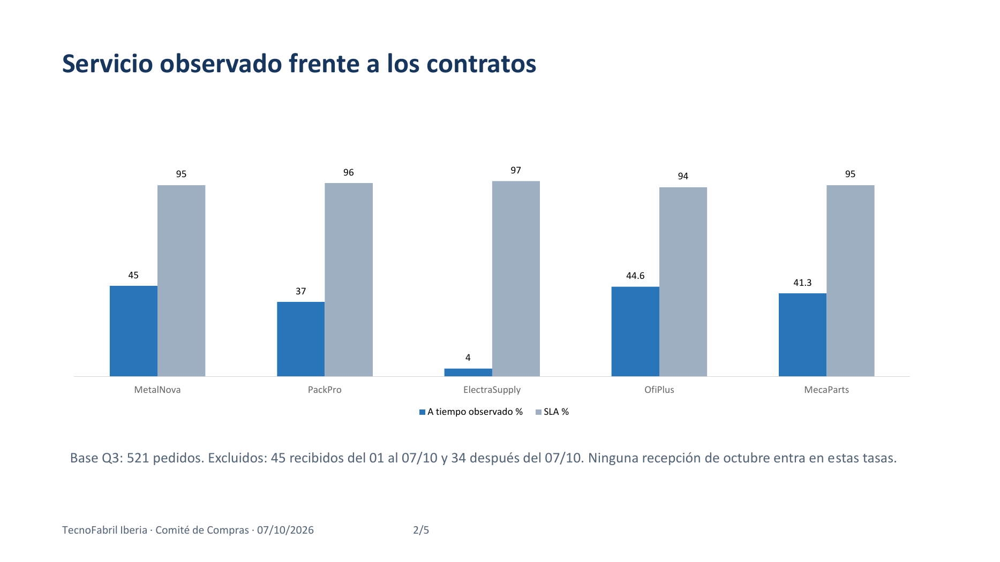

# Evaluación de proveedores para la renovación de 2027

**Caso práctico de IA aplicada a compras y análisis de datos** · Empresa y datos ficticios

[Explorar el portfolio](https://ex-1215.github.io/portfolio-ia-compras-proveedores/) · [Ver los entregables](#entregables)

Una empresa industrial debe revisar cinco proveedores antes de renovar sus acuerdos. El trabajo parte de pedidos, compromisos de servicio y ofertas comerciales. Su resultado es una propuesta por proveedor que puede revisarse desde los datos hasta la recomendación para comité.

| Alcance | Base de servicio | Decisión propuesta |
| :--- | :--- | :--- |
| **600 pedidos** emitidos entre julio y septiembre de 2026 | **521 pedidos** emitidos y recibidos dentro del trimestre | Renegociar con **4 proveedores** y evaluar alternativas para **1** |

*Los cinco proveedores quedaron por debajo de su objetivo de puntualidad en la muestra definida. ElectraSupply registró 4 entregas a tiempo de 101 pedidos; la propuesta es estudiar una alternativa y exigir un plan de recuperación verificable.*

## Del dato a la decisión

1. **Delimitar la muestra.** Los indicadores de servicio usan pedidos emitidos y recibidos dentro del trimestre. El gasto trimestral usa los 600 pedidos emitidos.
2. **Comparar lo medido con lo pactado.** Se revisan puntualidad, rechazos, incidencias y condiciones comerciales por proveedor.
3. **Documentar la recomendación.** El análisis se convierte en un informe con acciones y condiciones pendientes, y en una presentación para comité.

## Entregables

| Pieza | Lectura en el navegador | Archivo editable |
| :--- | :--- | :--- |
| **Análisis de proveedores** — base, indicadores y comparaciones | [Ver análisis](https://ex-1215.github.io/portfolio-ia-compras-proveedores/vistas/analisis.html) | [Descargar Excel](docs/archivos/Analisis_Proveedores.xlsx) |
| **Recomendación de renovación** — decisiones y límites de la evidencia | [Leer informe en PDF](https://ex-1215.github.io/portfolio-ia-compras-proveedores/vistas/Recomendacion_Renovacion.pdf) | [Descargar Word](docs/archivos/Recomendacion_Renovacion.docx) |
| **Presentación para comité** — síntesis de resultados y próximos pasos | [Ver presentación en PDF](https://ex-1215.github.io/portfolio-ia-compras-proveedores/vistas/Comite_Compras.pdf) | [Descargar PowerPoint](docs/archivos/Comite_Compras.pptx) |

## Criterio y límites

La recomendación es **provisional**. Antes de firmar, sustituir un proveedor o trasladar volumen, Compras debe revisar las condiciones por escrito y validar la capacidad de las alternativas. El índice de precio de las ofertas es relativo a 100: no permite afirmar un ahorro en euros. Los descuentos planteados son propuestas de negociación, no acuerdos firmados.

Este repositorio muestra un **ejercicio**, no una implantación en una empresa real. Los datos, la empresa y las firmas son ficticios. El enunciado de la práctica no se publica aquí.
